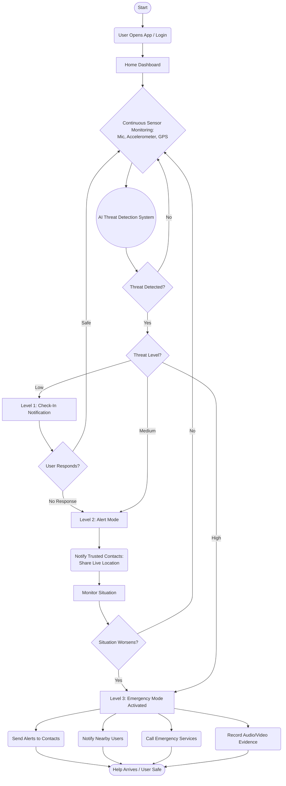

# 🛡️ RAKSHAK: Unified Safety Protocol

**RAKSHAK** is a state-of-the-art emergency response and personal safety system designed for women's security. It integrates **on-device machine learning**, **real-time geospatial broadcasts**, and **privacy-first architectural patterns** to provide a hands-free, high-reliability safety net.

---

## ✨ Key Features

### 🎙️ Hands-Free SOS Trigger
- **On-Device Keyword Detection**: Utilizes quantized **TensorFlow Lite (TFLite)** models to detect distress keywords (e.g., "Help") with zero latency and zero data egress.
- **Biometric Voice Signature**: Maps unique acoustic features during setup for personalized security.

### 📍 Geospatial Alert Broadcast
- **200m Neighborhood Protocol**: Automatically notifies all Rakshak users within a 200-meter radius when an emergency is verified.
- **Dead-Man's Switch**: A 60-second countdown allows users to cancel false alarms before escalation to guardians and community responders.

### 🔒 Privacy-First Engineering
- **End-to-End Encryption**: All evidence (audio/location) is encrypted with **AES-256** before transmission.
- **Micro-Access Logs**: Transparent tracking of microphone, location, and motion sensor usage.

---

## 🔄 Core Technical Flow

The project follows a **Tiered Escalation System** designed to minimize false alarms while ensuring zero-latency response during critical threats.



1. **Level 1 (Low Threat)**: A silent "Check-in" notification is sent to the user to verify safety.
2. **Level 2 (Medium Threat)**: Trusted contacts are notified of potential distress and live location sharing begins.
3. **Level 3 (High Threat)**: The full emergency protocol is activated, including community broadcasts, emergency services dispatch, and automated evidence recording.

---

## 🛠️ Technology Stack

| Component | Technology | Role |
| :--- | :--- | :--- |
| **Mobile** | React Native / Expo | Cross-platform UI, Sensor acquisition |
| **Backend** | Python / Django | Alert coordination, Notification dispatch |
| **ML Engine** | TensorFlow Lite | On-device keyword & motion inference |
| **Database** | MongoDB | Highly scalable, flexible schema for logs |
| **Location** | Expo-Location / Haversine | Real-time GPS tracking & Geo-broadcasts |

---

## 📂 Project Structure

```bash
Rakshak/
├── mobile/            # React Native (Expo) Frontend
├── backend/           # Django (Python) REST API
├── ml/                # TFLite Models & Training Scripts
└── docs/              # Technical Deep-Dives & Diagrams
```

---

## 📖 Technical Documentation

Explore the inner workings of project Rakshak:

- [🚀 Installation Guide](docs/INSTALLATION_GUIDE.md) - Complete setup for Backend, Mobile, and Ngrok.
- [☁️ MongoDB Atlas Setup](docs/ATLAS_SETUP.md) - Deploying the cloud database.
- [🌐 Ngrok Tunneling Setup](docs/NGROK_SETUP.md) - Bridging the local connection.
- [🔗 Connection Verification Report](docs/CONNECTION_VERIFICATION_REPORT.md) - Full system connectivity and API testing logs.
- [📊 System Diagrams](docs/SYSTEM_DIAGRAMS.md) - Visualizing the logic and flows.
- [💎 Implementation Quality](docs/IMPLEMENTATION_QUALITY.md) - Security, reliability, and edge-cases.
- [⚙️ Technical Clarity](docs/TECHNICAL_CLARITY.md) - ML fusion and API architecture.
- [📈 Scalability Approach](docs/SCALABILITY.md) - Handling growth and geospatial performance.
- [🛠️ Environment variables template](.env.example) - Base configuration file.

---

## 🚀 Quick Start

For a detailed walkthrough, including MongoDB Atlas and Ngrok tunneling setup, please refer to the **[Comprehensive Installation Guide](docs/INSTALLATION_GUIDE.md)**.

### Basic Initialization

```bash
# Backend (Terminal 1)
cd backend && pip install -r requirements.txt
python manage.py runserver 0.0.0.0:8000

# Mobile (Terminal 2)
cd mobile && npm install
npx expo start
```

---

> [!NOTE]
> Created with a mission to empower and protect. Performance, Privacy, and Precision.
