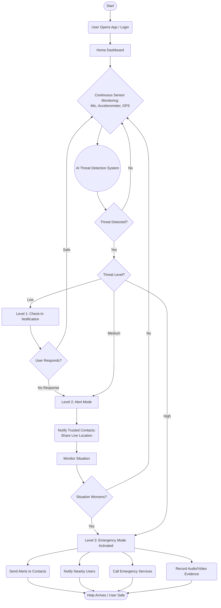
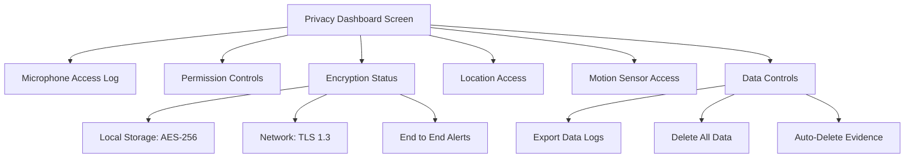
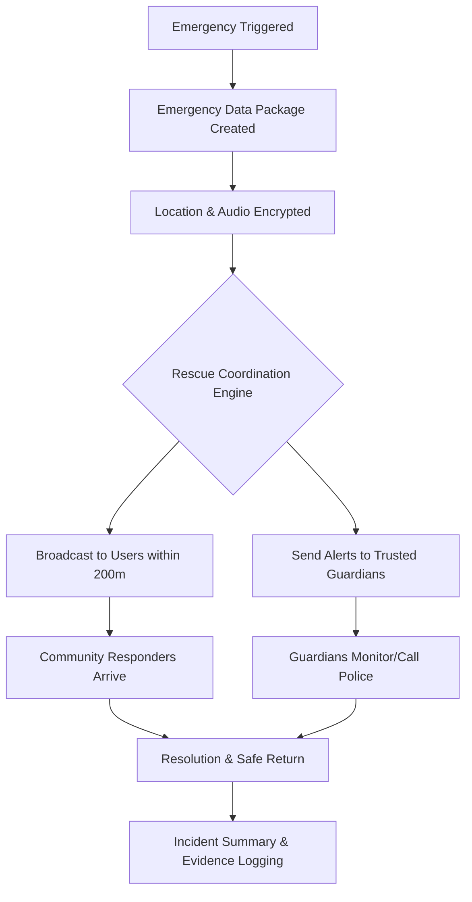
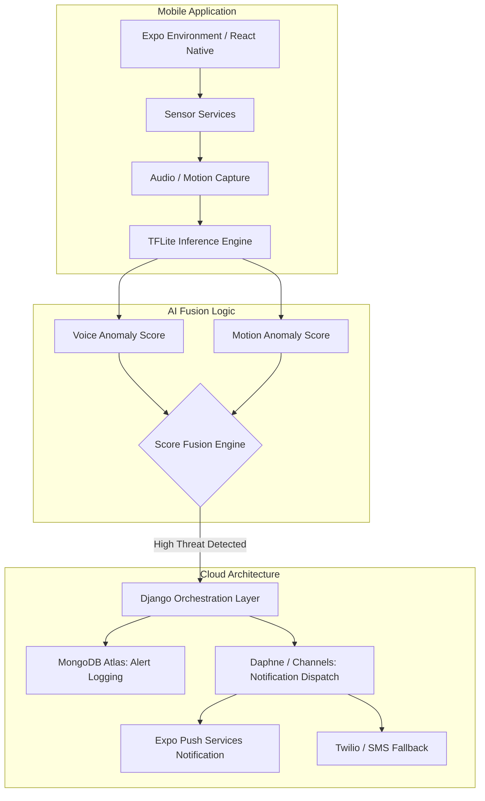

# 📊 Project Rakshak: System Diagrams

Project Rakshak's logic and architecture are visualized across four core domains: **Escalation Logic**, **Privacy**, **Emergency Response**, and **System Architecture**.

---

## 🔝 0. Complete System Decision Map
The primary flowchart illustrating high-level project flow from detection to resolution.

### Logic Breakdown:
1. **Continuous Monitoring**: Always-on sensors feed data into the AI detection engine.
2. **Tiered Assessment**: System classifies events into Level 1 (Low), Level 2 (Medium), or Level 3 (High).
3. **Automated Escalation**: Events naturally move up levels if the situation worsens or if the user fails to respond to check-ins.
4. **Resolution Gateway**: A final "User Safe" state ensures all evidence is saved and rescuers are stood down.

---

## 🔒 1. Privacy Dashboard Workflow
The Privacy Dashboard ensures that users have full control over their sensitive data.

### Key Components:
- **Microphone Access Logs**: Displays the reason for access (e.g., "Keyword detection"), the result (e.g., "No trigger"), and encryption status.
- **Encryption Status**: Highlights the use of **AES-256** for local storage and **TLS 1.3** for network transmissions.
- **Data Controls**: "Right to Be Forgotten" implementation with "Delete All Data" and "Auto-Delete Settings" for evidence (24 hours) and location (30 days).

---

## 🚨 2. Emergency Response Flow (SOS)
This diagram maps the high-stakes journey from a distress signal to a resolved incident.

### The Journey:
1. **Trigger**: Emergency triggered via voice signature or manual pulse.
2. **Data Package**: Creation of a secure package containing **GPS Coordinates**, **Threat Type (Screaming/Struggle)**, and **Encrypted Audio**.
3. **Rescue Coordination**: Anonymous broadcast to nearby users within 200m and direct alerts to verified guardians.
4. **Resolution**: Final incident summary and evidence package generation for legal/verification purposes.

---

## ⚙️ 3. Full System Architecture
A deep dive into the background services and ML processing layers.

### Functional Layers:
- **Background Services**: Continuous monitoring using low-energy sensor handlers for microphone and motion data.
- **ML Fusion Engine**: A multi-model inference system where Keyword Spoting and Motion Anomaly scores are fused to determine the holistic threat level (LOW/MEDIUM/HIGH).
- **Communication Hub**: Dispatching alerts through **Expo Push (Notifications)** and **Native SMS (Fallback)** when internet connectivity is intermittent.
- **Data Providers**: Real-time sync with MongoDB for user-profiles, contacts, and secure evidence storage.
